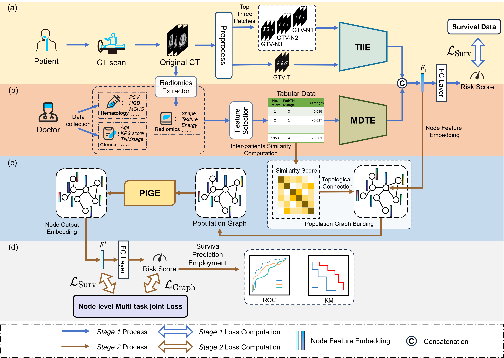

## A Novel Multi-modal Population-graph based Framework for Patients of Esophageal Squamous Cell Cancer Prognostic Risk Prediction

## A Quick Overview 

## Setup
### Requirements
* Linux (tested on Ubuntu 16.04, 18.04, 20.04)
* Python 3.6+
* PyTorch 1.6 or higher (tested on PyTorch 1.13.1)
* CUDA 11.3 or higher (tested on CUDA 11.6+torch-geometric 2.2.0)

### Installation
  
``conda env create -f environment.yml``

## Proposed Model

The code of proposed MPGSurv model can be seen in  ``/model``.

## Dataset

we apologize that we do not have the right to disclose the datasets collected by the hospital. Due to ethical review and patient privacy disclosure restrictions, we are unable to request public disclosure of the dataset at this time. In addition, future work will be based on this dataset and it is not appropriate to disclose the dataset at this time. The data types and requirements can be set according to ``/dataloader/Dataset.py``.

## Acknowlegment

Our repo is developed based on the these projects: [MMMNA-Net](https://github.com/TangWen920812/mmmna-net), [GraphSAGE](https://github.com/twjiang/graphSAGE-pytorch)
